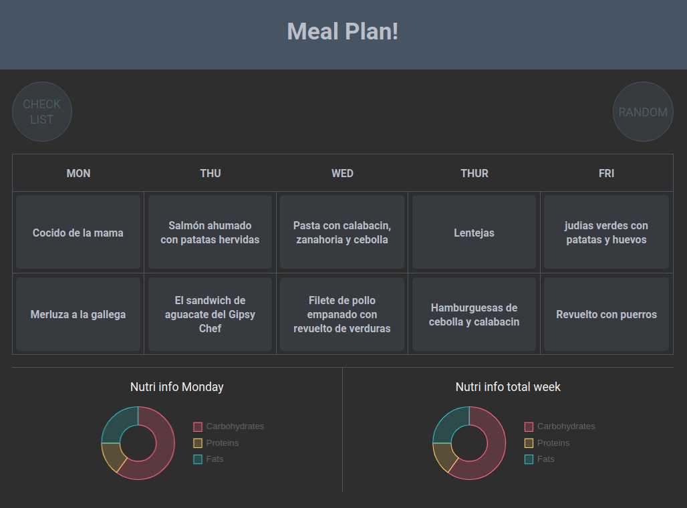

 

# 🌱 Mealplan!
Javascript-based application that randomly displays a menu of meals (own recipes) from Monday to Friday
You can use the draggable to change the position of the cards.
You can also see in the chart the nutritional information by day and week.
Meals are only organized into lunch and dinner, differentiating that there are some foods that cannot be included at dinner.
Check your food list by clicking on "check list" button.

### Feature
Developed with ⚡️ React Hooks [ useState, useEffect, useContext, useRef ]
* Functional components (State-less Functions)
* Context API

### Technologies
* ✨ Node.js
* 💣 React
* 💅🏾 Styled Components

### Funcionality
* Show meal list clicking at "check list" button
* Sorts meals randomly clicking at "Random" button
* Drag & drop meals
* Nutrient charts (By day and by week)

### Dependencies
* chart.js
* react-chartjs-2
* react-beautiful-dnd
* styled-components